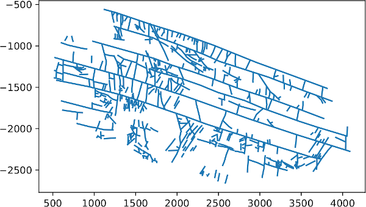

# Georef_fracture_traces: Jupyter notebook to georeference fracture trace maps

## Description
[georef_fracture_traces.ipynb](georef_fracture_traces.ipynb) is a Jupyter notebook that was designed to create 3D georeferenced fracture networks from digitised fracture traces from outcrop photos. In addition the 3D fracture network can be projected onto a plane to generate a 2D georeferenced fracture network that can be used for fracture network analysis and further fluid flow or geomechanical modelling workflows. 

The starting point is a vector (line) shapefile with the locations of fractures. This can be obtained for instance by importing an outcrop photo to QGIS or other GIS software and manually drawing the fracture lines on the photo. Georeferencing of the fracture network can be performed using a first or second order polynomial transform. The 3D georeferenced fracture dataset is saved as a shapefile and as a GeoJSON file. In addition the georeferenced 3D fracture network can be projected back onto a vertical, horizontal or inclined plane. The resulting projected 2D fracture network is also saved as a shapefile and can be used for further analysis of the fracture network using software such as [NetworkGT](https://github.com/BjornNyberg/NetworkGT).

This notebook was created for the [MEET project](https://www.meet-h2020.com/), which is an EU Horizon 2020 project aimed at demonstrating enhanced geothermal system exploration and exploitation.

Outcrop                           |  Georeferenced fractures
:--------------------------------:|:-------------------------------------:
  |  

## Dependencies

The notebook requires [Jupyter](https://jupyter.org/), [Python 3.x](https://www.python.org/) and a number of additional Python packages: numpy, matplotlib, pandas, geopandas, scipy, shapely and sympy.

The easiest way to install these it to use [Anaconda Python](https://www.anaconda.com/products/individual) or another Python distribution.

## Workflow

1. Create a shapefile consisting of line segments of the locations of fractures in an (unreferenced) outcrop photo. See the shapefile [data/fractures.shp](data/fractures.shp) for an example.
2. Create a 2nd shapefile with ground control points, i.e., points in the outcrop photo for which you know the coordinates. Add three columns to the attribute table of this shapefile named X, Y and ELEVATION and add the coordinates to these columns. See the shapefile [data/control_pts.shp](data/control_pts.shp) for an example.
3. 
    1. Create a 3rd shapefile that contains three points that define a plane (optional). The georeferenced fracture network will be projected to this plane and saved as a new 2D shapefile. The file should follow the same format as the control points shapefile. Note that the plane defined by these points should be large enough to cover the entire fracture network. For example if the plane is defined at x coordinate = 5 m at x coordinate = 10 m, but one of the fractures is located at x = 1 m, then the projection to the plane will distort the fracture image. In this case one would have to look for a point that defines the plane with the x coordinate = 1 m or less.
    2. Or in case of a perfectly horizontally or vertically oriented outcrop one can skip the creation of a plane point shapefile and instead let the notebook create a vertical or horizontal plane. In this case one needs to set the variable ``get_plane_pts_from_file = False``. In addition you can tell the notebook whether your outcrop is oriented vertically or horizontally by setting the variable ``plane_orientation`` to ``'vertical'`` or ``'horizontal'``.
4. Start the jupyter notebook [georef_fracture_traces.ipynb](georef_fracture_traces.ipynb) and update the variables ``shpfile`` and ``control_pt_file`` with the names of your fracture network and control point shapefiles that you created in step 1 and 2
5. Update the variable ``plane_pt_file`` to point to the shapefile with the points that define the plane, i.e., the file that you created in step 3. Note that when you choose the option ``get_plane_pts_from_file = False`` then this step is not needed.
6. Run the notebook and inspect the text and images that were generated by the notebook and the output files to make sure everything went well.

## Results:

If all went well there should now be two new shapefiles in the directory data. One shapefile with the georeferenced fracture traces (see the example shapefile [data/fractures_georef.shp](data/fractures_georef.shp)) and one shapefile with the georeferenced traces projected to a plane (see example shapefile [data/fractures_projected_to_plane.shp](data/fractures_projected_to_plane.shp)). The georeferenced fractures are also saved as a GeoJSON file ([data/fractures_georef.geojson](data/fractures_georef.geojson)).

The notebook should also have generated a number of figures. These include a figure with the georeferencing results for the control points ([fig/transform_error.pdf](fig/transform_error.pdf)), a 3D figure of the georeferenced fracture traces ([fig/fractures_georef_3d_fig.pdf](fig/fractures_georef_3d_fig.pdf)) and a figure of the same georeferenced fracture traces viewed from three directions ([fig/fractures_georef_2d_fig.pdf](fig/fractures_georef_2d_fig.pdf)). The georeferencing results for the control points are also saved as a csv file ([data/georeferencing_results_control_pts.csv](data/georeferencing_results_control_pts.csv)) that can be inspected using excel, openoffice or a texteditor.

*The digitised but still not georeferenced fracture network. This is a digitised set of fractures from an outcrop in the Harz Mountains, Germany that was provided by Katherine Ford, University of Göttingen. The fracture network was digitised by importing the outcrop photo in QGIS and manually creating a shapefile with lines that trace the fractures in the photo.*

*3D figure of the georeferenced fracture network*

*The georeferenced fracture network projected onto a plane*

*The outcrop. Photo supplied by Katherine Ford, University of Göttingen*

## Authors
* **Elco Luijendijk**, University of Göttingen, <elco.luijendijk-at-posteo.de>

## Reference

## License
This project is licensed under the GNU lesser general public license (LGPL v3). See the [LICENSE.txt](LICENSE.txt) file for details.

