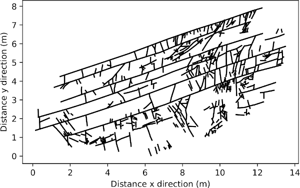

# Georef_fracture_traces: Jupyter notebooks to georeference fracture trace maps

## Description
Georef_fracture_traces is a Python notebook that was designed to create 3D georeferenced fracture networks from digitized fracture traces from outcrop photos. In addition the 3D fracture network can be projected onto a plane to generate a 2D georeferenced fracture network that can be used for fracture network analysis and further fluid flow or geomechanical modelling workflows. Georeferencing can be performed using a first or second order polynomial. 

Outcrop                           |  Georeferenced fractures
:--------------------------------:|:-------------------------------------:
  |  

## Dependencies

The notebook uses Python 3.x and a number of additional Python packages: numpy, matplotlib, pandas, geopandas, scipy, shapely, sympy.

The easiest way to install these it to use Anaconda Python: https://www.anaconda.com/products/individual

## Workflow

1. Create a shapefile with the locations of fractures in an (unreferenced) outcrop photo
2. Create a 2nd shapefile with ground control points, i.e., points in the outcrop photo for which you know the coordinates. Add three columns to this shapefile named x, y and z and add the coordinates to these columns
3. Create a 3rd shapefile that contains three points that define a plane. The georeferenced fracture network will be projected to this plane and saved as a new 2D shapefile. This step is optional. In case of a perfectly horizontally or vertically oriented outcrop you can also let the notebook define a plane for you by setting the variable ``get_plane_pts_from_file = False``.
4. Start the jupyter notebook [georef_fracture_traces.ipynb](georef_fracture_traces.ipynb) and update the variables ``shpfile`` and ``control_pt_file`` with the names of your fracture network and control point shapefiles that you created in step 1 and 2
5. Update the variable ``plane_pt_file`` to point to the shapefile with the points that define the plane, i.e., the file that you created in step 3. Note that when you choose the option ``get_plane_pts_from_file = False`` then this step is not needed.
6. Run the notebook and inspect the text and images that were generated by the notebook and the output files to make sure everything went well.
7. If all went well there should now be two new shapefiles in the directory data. One shapefile with the georeferenced fracture traces (see the example shapefile [data/fractures_georef.shp](data/fractures_georef.shp)) and one shapefile with the georeferenced traces projected to a plane (see example shapefile [data/fractures_projected_to_plane.shp](data/fractures_projected_to_plane.shp)). The georeferenced fractures are also saved as a GeoJSON file ([data/fractures_georef.geojson](data/fractures_georef.geojson)).
8. The notebook should also have generated a number of figures of the model results. These include a figure with the georefencing results for the control points ([fig/transform_error.pdf](fig/transform_error.pdf)), a 3D figure of the georeferenced fracture traces ([fig/fractures_georef_3d_fig.pdf](fig/fractures_georef_3d_fig.pdf)) and a figure of the same georeferenced fracture traces viewed from three directions ([fig/fractures_georef_2d_fig.pdf](fig/fractures_georef_2d_fig.pdf)). THe georeferencing results for the control points are also saved as a csv file ([data/georeferencing_results_control_pts.csv](data/georeferencing_results_control_pts.csv)) that can be inspected using excel, openoffice or a texteditor.

*The digitized but still not georeferenced fracture network. This is a digitized set of fractures from an outcrop in the Harz Mountains, Germany that was provided by Katherine Ford, University of Goettingen.*

*3D figure of the georeferenced fracture network*

*The georeferenced fracture network projected onto a plane*

*The outcrop. Photo supplied by Katherine Ford, University of Goettingen*

## Authors
* **Elco Luijendijk**, <elco.luijendijk-at-posteo.de>

## Reference

## License
This project is licensed under the GNU lesser general public license (LGPL v3). See the [LICENSE.txt](LICENSE.txt) file for details.

